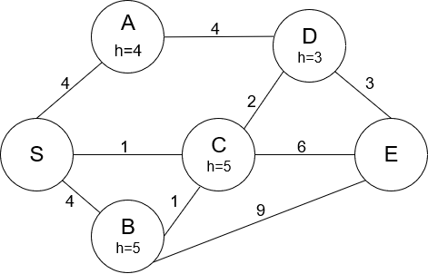
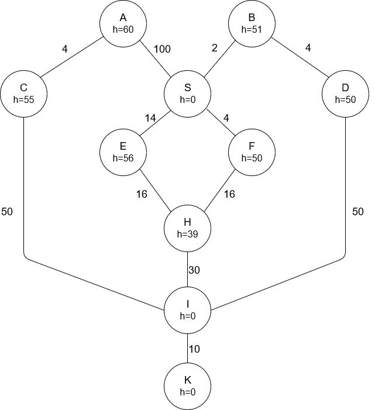

# AI - Classical Search Algorithms

> Implementation of the several classical search algorithms such as Breadth-First Search, Depth-First Search, etc.

## Requirements

Java 10 or above (because of the local variable type inference).

## Usage

### Defining the search problem

- You can build the problem using Java code, step by step. There are three different problems returned by the static methods problemExample1(), problemExample2(), etc.

```java
Problem problem = problemExample1();
```

- Or You can parse the problem from .txt or .json file. The file structure is given by example, problem2.json and problem3.txt.

```java
File problemFile = new File(Main.class.getResource("/problem3.txt").toURI());
Problem problem = Problem.fromFile(Problem.FileType.TXT, problemFile);
```
### Starting the search

Once you have the problem defined you should make an instance of the Search class:

```java
Search search = new Search(problem);
```
and then, you can start the search by calling the run method of the search object, passing the search algorithm as a parameter. Parameter `boolean verbose` which is passed to the search algorithm constructor defines whether the search should be verbose. If true, additional information will be printed to the console, such as the order of the node expansion, frontier and explored nodes in every step.

```java
search.run(new BreadthFirstSearch(true));
```

### Printing the result

When the search is completed, you can print a solution, it's the path from the start state to the goal state.

```java
search.printSolution(System.out);
```

### Graphs for the problem1, problem2 and problem3

#### Problem 1

#### Problem 2

#### Problem 3

